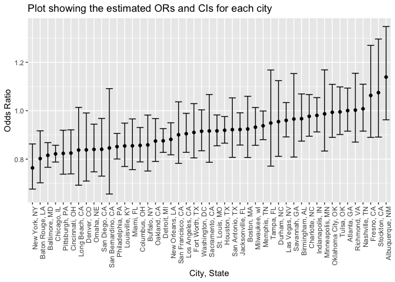

p8105_hw6_yk2959
================
Kiran Kui
2022-11-29

# Problem 2

``` r
homicide_df = read_csv("./data/homicide-data.csv") %>%
  janitor::clean_names() 
```

    ## Rows: 52179 Columns: 12
    ## ── Column specification ────────────────────────────────────────────────────────
    ## Delimiter: ","
    ## chr (9): uid, victim_last, victim_first, victim_race, victim_age, victim_sex...
    ## dbl (3): reported_date, lat, lon
    ## 
    ## ℹ Use `spec()` to retrieve the full column specification for this data.
    ## ℹ Specify the column types or set `show_col_types = FALSE` to quiet this message.

``` r
skimr::skim(homicide_df)
```

|                                                  |             |
|:-------------------------------------------------|:------------|
| Name                                             | homicide_df |
| Number of rows                                   | 52179       |
| Number of columns                                | 12          |
| \_\_\_\_\_\_\_\_\_\_\_\_\_\_\_\_\_\_\_\_\_\_\_   |             |
| Column type frequency:                           |             |
| character                                        | 9           |
| numeric                                          | 3           |
| \_\_\_\_\_\_\_\_\_\_\_\_\_\_\_\_\_\_\_\_\_\_\_\_ |             |
| Group variables                                  | None        |

Data summary

**Variable type: character**

| skim_variable | n_missing | complete_rate | min | max | empty | n_unique | whitespace |
|:--------------|----------:|--------------:|----:|----:|------:|---------:|-----------:|
| uid           |         0 |             1 |   9 |  10 |     0 |    52179 |          0 |
| victim_last   |         0 |             1 |   1 |  20 |     0 |    12687 |          0 |
| victim_first  |         0 |             1 |   1 |  28 |     0 |    16640 |          0 |
| victim_race   |         0 |             1 |   5 |   8 |     0 |        6 |          0 |
| victim_age    |         0 |             1 |   1 |   7 |     0 |      102 |          0 |
| victim_sex    |         0 |             1 |   4 |   7 |     0 |        3 |          0 |
| city          |         0 |             1 |   5 |  14 |     0 |       50 |          0 |
| state         |         0 |             1 |   2 |   2 |     0 |       28 |          0 |
| disposition   |         0 |             1 |  14 |  21 |     0 |        3 |          0 |

**Variable type: numeric**

| skim_variable | n_missing | complete_rate |        mean |         sd |          p0 |         p25 |         p50 |         p75 |          p100 | hist  |
|:--------------|----------:|--------------:|------------:|-----------:|------------:|------------:|------------:|------------:|--------------:|:------|
| reported_date |         0 |             1 | 20130899.16 | 1123419.63 | 20070101.00 | 20100318.00 | 20121216.00 | 20150911.00 | 201511105\.00 | ▇▁▁▁▁ |
| lat           |        60 |             1 |       37.03 |       4.35 |       25.73 |       33.77 |       38.52 |       40.03 |         45.05 | ▁▅▅▇▅ |
| lon           |        60 |             1 |      -91.47 |      13.75 |     -122.51 |      -96.00 |      -87.71 |      -81.76 |        -71.01 | ▃▁▃▇▅ |

I have imported the homicide dataset from the github repository and
tidied the names of the variables in the dataset.

## Brief introduction of the raw homicide dataset

The raw dataset contains 52179 rows and 12 columns, with each row
representing a single record of homicide in 50 large U.S. cities.

Variables include, date of homicide, victim first and last name,
victims’ race, age, sex and the city/state that the homicide was
located, as well as the lattitude and longitude of the homicide
location, given in uid, reported_date, victim_last, victim_first,
victim_race, victim_age, victim_sex, city, state, lat, lon, disposition.

``` r
homicide_df_clean_1 = homicide_df %>% 
  unite(city_state, c(city, state), sep = ", ", remove = FALSE) %>% 
  select(-city, -state) %>% 
  mutate(
  resolved = ifelse(
  disposition %in% c('Closed without arrest', 'Open/No arrest'), 0, 1)) %>% 
    filter(!city_state %in% c('Dallas, TX', 'Phoenix, AZ', 'Kansas City, MO', 'Tulsa, AL')) %>%    filter(victim_race %in% c('Black', 'White')) %>%
  mutate(victim_age = as.numeric(victim_age))
```

    ## Warning in mask$eval_all_mutate(quo): NAs introduced by coercion

``` r
homicide_df_clean_1
```

    ## # A tibble: 39,693 × 12
    ##    uid       repor…¹ victi…² victi…³ victi…⁴ victi…⁵ victi…⁶ city_…⁷   lat   lon
    ##    <chr>       <dbl> <chr>   <chr>   <chr>     <dbl> <chr>   <chr>   <dbl> <dbl>
    ##  1 Alb-0000…  2.01e7 SATTER… VIVIANA White        15 Female  Albuqu…  35.1 -107.
    ##  2 Alb-0000…  2.01e7 MULA    VIVIAN  White        72 Female  Albuqu…  35.1 -107.
    ##  3 Alb-0000…  2.01e7 BOOK    GERALD… White        91 Female  Albuqu…  35.2 -107.
    ##  4 Alb-0000…  2.01e7 MARTIN… GUSTAVO White        56 Male    Albuqu…  35.1 -107.
    ##  5 Alb-0000…  2.01e7 LUJAN   KEVIN   White        NA Male    Albuqu…  35.1 -107.
    ##  6 Alb-0000…  2.01e7 GRAY    STEFAN… White        43 Female  Albuqu…  35.1 -107.
    ##  7 Alb-0000…  2.01e7 DAVID   LARRY   White        52 Male    Albuqu…  NA     NA 
    ##  8 Alb-0000…  2.01e7 BRITO   ELIZAB… White        22 Female  Albuqu…  35.1 -107.
    ##  9 Alb-0000…  2.01e7 KING    TEVION  Black        15 Male    Albuqu…  35.1 -107.
    ## 10 Alb-0000…  2.01e7 BOYKIN  CEDRIC  Black        25 Male    Albuqu…  35.1 -107.
    ## # … with 39,683 more rows, 2 more variables: disposition <chr>, resolved <dbl>,
    ## #   and abbreviated variable names ¹​reported_date, ²​victim_last, ³​victim_first,
    ## #   ⁴​victim_race, ⁵​victim_age, ⁶​victim_sex, ⁷​city_state

I create a city_state variable (e.g. “Baltimore, MD”), and a binary
variable indicating whether the homicide is solved. I then omitted
cities Dallas, TX; Phoenix, AZ; and Kansas City, MO because these don’t
report victim race and also omit Tulsa, AL because this is a data entry
mistake. I limited my analysis those for whom victim_race is white or
black.I converted victim_age from a character to a numeric variable.

``` r
fit_logistic = homicide_df_clean_1 %>% 
  filter(city_state %in% c('Baltimore, MD')) %>% 
  glm(resolved ~ victim_age + victim_sex + victim_race, data = ., family = binomial()) %>% 
  broom::tidy() %>% 
  mutate(
    odds_ratio = exp(estimate),
    lower_CI = exp(estimate - 1.96 * std.error),
    upper_CI = exp(estimate + 1.96 * std.error)
  ) %>% 
  select(term, odds_ratio, lower_CI, upper_CI) %>%
  filter(term == "victim_sexMale") %>% 
  knitr::kable(digits = 3)

fit_logistic
```

| term           | odds_ratio | lower_CI | upper_CI |
|:---------------|-----------:|---------:|---------:|
| victim_sexMale |      0.426 |    0.325 |    0.558 |

For the city of Baltimore, MD, I used the glm function to fit a logistic
regression with resolved vs unresolved as the outcome and victim age,
sex and race as predictors.

I saved the output of glm as an R object and applied the broom::tidy to
this object then obtained the estimate and confidence interval of the
adjusted odds ratio for solving homicides comparing male victims to
female victims keeping all other variables fixed.

``` r
homicide_df_clean_2 = 
  homicide_df_clean_1 %>% 
  nest(data = -city_state) %>% 
mutate(
  all_countries = 
    map(.x = data, ~glm(glm(resolved ~ victim_age + victim_race + victim_sex, data = .x, family = binomial()))),
  result = map(all_countries, broom::tidy) 
  ) %>% 
select(city_state, result) %>% 
 unnest(result) %>% 
  mutate(
    odds_ratio = exp(estimate),
    lower_CI = exp(estimate - 1.96 * std.error),
    upper_CI = exp(estimate + 1.96 * std.error)
  ) %>% 
  select(city_state, term, odds_ratio,lower_CI, upper_CI) %>% 
  filter(term == "victim_sexMale") %>% 
  mutate(city_state = fct_reorder(city_state, odds_ratio)) 

ggplot_q2 = 
  homicide_df_clean_2 %>% 
  ggplot(aes(x = city_state, y = odds_ratio)) + 
  geom_point() + 
  geom_errorbar(aes(ymin = lower_CI, ymax = upper_CI)) + 
  theme(axis.text.x = element_text(angle = 90, hjust = 1)) + 
  labs(title = "Plot showing the estimated ORs and CIs for each city",
    x = "City, State",
    y = "Odds Ratio")

ggplot_q2
```

<!-- -->

I ran a glm for each of the cities in your dataset, and extracted the
adjusted odds ratio (and CI) for solving homicides comparing male
victims to female victims. Do this within a “tidy” pipeline, making use
of purrr::map, list columns, and unnest as necessary to create a
dataframe with estimated ORs and CIs for each city.

I created a plot that shows the estimated ORs and CIs for each city and
organized cities according to estimated OR, and comment on the plot.
