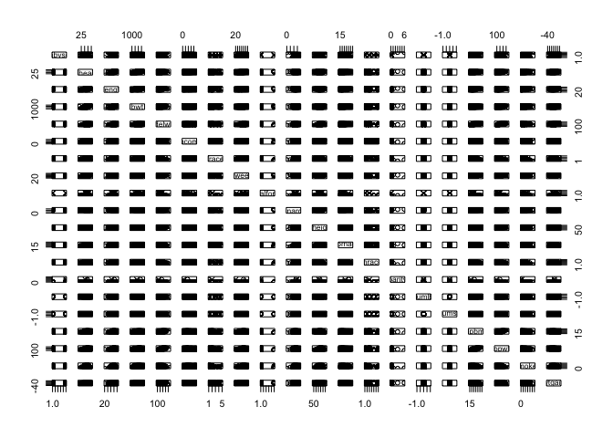
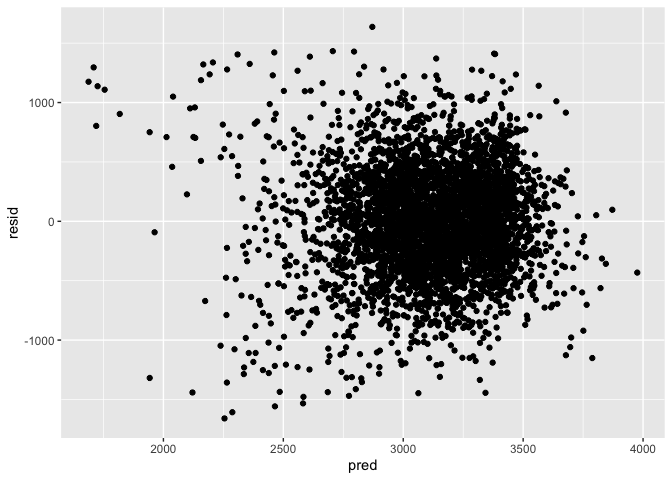

p8105_hw6_yk2959
================
Kiran Kui
2022-11-29

# Problem 1

To obtain a distribution for $\hat{r}^2$, I will draw bootstrap samples;
the a model to each; extract the value I’m concerned with; and
summarize. I used `modelr::bootstrap` to draw the samples and
`broom::glance` to produce `r.squared` values.

``` r
nynoaa_df = 
  rnoaa::meteo_pull_monitors(
    c("USW00094728"),
    var = c("PRCP", "TMIN", "TMAX"), 
    date_min = "2017-01-01",
    date_max = "2017-12-31") %>%
  mutate(
    name = recode(id, USW00094728 = "CentralPark_NY"),
    tmin = tmin / 10,
    tmax = tmax / 10) %>%
  select(name, id, everything())
```

    ## Registered S3 method overwritten by 'hoardr':
    ##   method           from
    ##   print.cache_info httr

    ## using cached file: ~/Library/Caches/R/noaa_ghcnd/USW00094728.dly

    ## date created (size, mb): 2022-12-02 17:59:04 (8.426)

    ## file min/max dates: 1869-01-01 / 2022-11-30

``` r
nynoaa_df %>% 
  modelr::bootstrap(n = 1000) %>% 
  mutate(
    models = map(strap, ~lm(tmax ~ tmin, data = .x) ),
    results = map(models, broom::glance)) %>% 
  select(-strap, -models) %>% 
  unnest(results) %>% 
  ggplot(aes(x = r.squared)) + geom_density()
```

<!-- -->

The $\hat{r}^2$ value is high, and the upper bound at 1 may be a cause
for the generally skewed shape of the distribution. If we wanted to
construct a confidence interval for $R^2$, we could take the 2.5% and
97.5% quantiles of the estimates across bootstrap samples. However,
because the shape isn’t symmetric, using the mean +/- 1.96 times the
standard error probably wouldn’t work well.

We can produce a distribution for $\log(\beta_0 * \beta1)$ using a
similar approach, with a bit more wrangling before we make our plot.

``` r
nynoaa_df %>% 
  modelr::bootstrap(n = 1000) %>% 
  mutate(
    models = map(strap, ~lm(tmax ~ tmin, data = .x) ),
    results = map(models, broom::tidy)) %>% 
  select(-strap, -models) %>% 
  unnest(results) %>% 
  select(id = `.id`, term, estimate) %>% 
  pivot_wider(
    names_from = term, 
    values_from = estimate) %>% 
  rename(beta0 = `(Intercept)`, beta1 = tmin) %>% 
  mutate(log_b0b1 = log(beta0 * beta1)) %>% 
  ggplot(aes(x = log_b0b1)) + geom_density()
```

<!-- -->

As with $r^2$, this distribution is somewhat skewed and has some
outliers.

# Problem 2

``` r
homicide_df = read_csv("./data/homicide-data.csv") %>%
  janitor::clean_names() 
```

    ## Rows: 52179 Columns: 12
    ## ── Column specification ────────────────────────────────────────────────────────
    ## Delimiter: ","
    ## chr (9): uid, victim_last, victim_first, victim_race, victim_age, victim_sex...
    ## dbl (3): reported_date, lat, lon
    ## 
    ## ℹ Use `spec()` to retrieve the full column specification for this data.
    ## ℹ Specify the column types or set `show_col_types = FALSE` to quiet this message.

``` r
skimr::skim(homicide_df)
```

|                                                  |             |
|:-------------------------------------------------|:------------|
| Name                                             | homicide_df |
| Number of rows                                   | 52179       |
| Number of columns                                | 12          |
| \_\_\_\_\_\_\_\_\_\_\_\_\_\_\_\_\_\_\_\_\_\_\_   |             |
| Column type frequency:                           |             |
| character                                        | 9           |
| numeric                                          | 3           |
| \_\_\_\_\_\_\_\_\_\_\_\_\_\_\_\_\_\_\_\_\_\_\_\_ |             |
| Group variables                                  | None        |

Data summary

**Variable type: character**

| skim_variable | n_missing | complete_rate | min | max | empty | n_unique | whitespace |
|:--------------|----------:|--------------:|----:|----:|------:|---------:|-----------:|
| uid           |         0 |             1 |   9 |  10 |     0 |    52179 |          0 |
| victim_last   |         0 |             1 |   1 |  20 |     0 |    12687 |          0 |
| victim_first  |         0 |             1 |   1 |  28 |     0 |    16640 |          0 |
| victim_race   |         0 |             1 |   5 |   8 |     0 |        6 |          0 |
| victim_age    |         0 |             1 |   1 |   7 |     0 |      102 |          0 |
| victim_sex    |         0 |             1 |   4 |   7 |     0 |        3 |          0 |
| city          |         0 |             1 |   5 |  14 |     0 |       50 |          0 |
| state         |         0 |             1 |   2 |   2 |     0 |       28 |          0 |
| disposition   |         0 |             1 |  14 |  21 |     0 |        3 |          0 |

**Variable type: numeric**

| skim_variable | n_missing | complete_rate |        mean |         sd |          p0 |         p25 |         p50 |         p75 |          p100 | hist  |
|:--------------|----------:|--------------:|------------:|-----------:|------------:|------------:|------------:|------------:|--------------:|:------|
| reported_date |         0 |             1 | 20130899.16 | 1123419.63 | 20070101.00 | 20100318.00 | 20121216.00 | 20150911.00 | 201511105\.00 | ▇▁▁▁▁ |
| lat           |        60 |             1 |       37.03 |       4.35 |       25.73 |       33.77 |       38.52 |       40.03 |         45.05 | ▁▅▅▇▅ |
| lon           |        60 |             1 |      -91.47 |      13.75 |     -122.51 |      -96.00 |      -87.71 |      -81.76 |        -71.01 | ▃▁▃▇▅ |

I have imported the homicide dataset from the github repository and
tidied the names of the variables in the dataset.

## Brief introduction of the raw homicide dataset

The raw dataset contains 52179 rows and 12 columns, with each row
representing a single record of homicide in 50 large U.S. cities.

Variables include, date of homicide, victim first and last name,
victims’ race, age, sex and the city/state that the homicide was
located, as well as the lattitude and longitude of the homicide
location, given in uid, reported_date, victim_last, victim_first,
victim_race, victim_age, victim_sex, city, state, lat, lon, disposition.

``` r
homicide_df_clean_1 = homicide_df %>% 
  unite(city_state, c(city, state), sep = ", ", remove = FALSE) %>% 
  select(-city, -state) %>% 
  mutate(
  resolved = ifelse(
  disposition %in% c('Closed without arrest', 'Open/No arrest'), 0, 1)) %>% 
    filter(!city_state %in% c('Dallas, TX', 'Phoenix, AZ', 'Kansas City, MO', 'Tulsa, AL')) %>%    filter(victim_race %in% c('Black', 'White')) %>%
  mutate(victim_age = as.numeric(victim_age))
```

    ## Warning in mask$eval_all_mutate(quo): NAs introduced by coercion

``` r
homicide_df_clean_1
```

    ## # A tibble: 39,693 × 12
    ##    uid       repor…¹ victi…² victi…³ victi…⁴ victi…⁵ victi…⁶ city_…⁷   lat   lon
    ##    <chr>       <dbl> <chr>   <chr>   <chr>     <dbl> <chr>   <chr>   <dbl> <dbl>
    ##  1 Alb-0000…  2.01e7 SATTER… VIVIANA White        15 Female  Albuqu…  35.1 -107.
    ##  2 Alb-0000…  2.01e7 MULA    VIVIAN  White        72 Female  Albuqu…  35.1 -107.
    ##  3 Alb-0000…  2.01e7 BOOK    GERALD… White        91 Female  Albuqu…  35.2 -107.
    ##  4 Alb-0000…  2.01e7 MARTIN… GUSTAVO White        56 Male    Albuqu…  35.1 -107.
    ##  5 Alb-0000…  2.01e7 LUJAN   KEVIN   White        NA Male    Albuqu…  35.1 -107.
    ##  6 Alb-0000…  2.01e7 GRAY    STEFAN… White        43 Female  Albuqu…  35.1 -107.
    ##  7 Alb-0000…  2.01e7 DAVID   LARRY   White        52 Male    Albuqu…  NA     NA 
    ##  8 Alb-0000…  2.01e7 BRITO   ELIZAB… White        22 Female  Albuqu…  35.1 -107.
    ##  9 Alb-0000…  2.01e7 KING    TEVION  Black        15 Male    Albuqu…  35.1 -107.
    ## 10 Alb-0000…  2.01e7 BOYKIN  CEDRIC  Black        25 Male    Albuqu…  35.1 -107.
    ## # … with 39,683 more rows, 2 more variables: disposition <chr>, resolved <dbl>,
    ## #   and abbreviated variable names ¹​reported_date, ²​victim_last, ³​victim_first,
    ## #   ⁴​victim_race, ⁵​victim_age, ⁶​victim_sex, ⁷​city_state

I create a city_state variable (e.g. “Baltimore, MD”), and a binary
variable indicating whether the homicide is solved. I then omitted
cities Dallas, TX; Phoenix, AZ; and Kansas City, MO because these don’t
report victim race and also omit Tulsa, AL because this is a data entry
mistake. I limited my analysis those for whom victim_race is white or
black.I converted victim_age from a character to a numeric variable.

``` r
fit_logistic = homicide_df_clean_1 %>% 
  filter(city_state %in% c('Baltimore, MD')) %>% 
  glm(resolved ~ victim_age + victim_sex + victim_race, data = ., family = binomial()) %>% 
  broom::tidy() %>% 
  mutate(
    odds_ratio = exp(estimate),
    lower_CI = exp(estimate - 1.96 * std.error),
    upper_CI = exp(estimate + 1.96 * std.error)
  ) %>% 
  select(term, odds_ratio, lower_CI, upper_CI) %>%
  filter(term == "victim_sexMale") %>% 
  knitr::kable(digits = 3)

fit_logistic
```

| term           | odds_ratio | lower_CI | upper_CI |
|:---------------|-----------:|---------:|---------:|
| victim_sexMale |      0.426 |    0.325 |    0.558 |

``` r
summary(fit_logistic)
```

    ##      Length       Class        Mode 
    ##           3 knitr_kable   character

For the city of Baltimore, MD, I used the glm function to fit a logistic
regression with resolved vs unresolved as the outcome and victim age,
sex and race as predictors. I saved the output of glm as an R object and
applied the broom::tidy to this object. The estimate and 95% confidence
interval of the adjusted odds ratio for solving homicides comparing male
victims to female victims is 0.426 and (0.325, 0.558) respectively.

``` r
homicide_df_clean_2 = 
  homicide_df_clean_1 %>% 
  nest(data = -city_state) %>% 
mutate(
  all_countries = 
    map(.x = data, ~glm(glm(resolved ~ victim_age + victim_race + victim_sex, data = .x, family = binomial()))),
  result = map(all_countries, broom::tidy) 
  ) %>% 
select(city_state, result) %>% 
 unnest(result) %>% 
  mutate(
    odds_ratio = exp(estimate),
    lower_CI = exp(estimate - 1.96 * std.error),
    upper_CI = exp(estimate + 1.96 * std.error)
  ) %>% 
  select(city_state, term, odds_ratio,lower_CI, upper_CI) %>% 
  filter(term == "victim_sexMale") %>% 
  mutate(city_state = fct_reorder(city_state, odds_ratio)) 

ggplot_q2 = 
  homicide_df_clean_2 %>% 
  ggplot(aes(x = city_state, y = odds_ratio)) + 
  geom_point() + 
  geom_errorbar(aes(ymin = lower_CI, ymax = upper_CI)) + 
  theme(axis.text.x = element_text(angle = 90, hjust = 1)) + 
  labs(title = "Plot showing the estimated ORs and CIs for each city",
    x = "City, State",
    y = "Odds Ratio")

ggplot_q2
```

<!-- -->

I ran a glm for each of the cities in your dataset, and extracted the
adjusted odds ratio (and CI) for solving homicides comparing male
victims to female victims. I did this within a “tidy” pipeline, making
use of purrr::map, list columns, and unnest as necessary to create a
dataframe with estimated ORs and CIs for each city.

I created a plot that shows the estimated ORs and CIs for each city and
organized cities according to estimated OR.

The adjusted odds ratio for solving homicides comparing male victims to
female victims is highest in Albuquerque, NM and lowest in New York, NY.

# Problem 3

``` r
birthweight_df = read_csv("./data/birthweight.csv") %>%
  janitor::clean_names() 
```

    ## Rows: 4342 Columns: 20
    ## ── Column specification ────────────────────────────────────────────────────────
    ## Delimiter: ","
    ## dbl (20): babysex, bhead, blength, bwt, delwt, fincome, frace, gaweeks, malf...
    ## 
    ## ℹ Use `spec()` to retrieve the full column specification for this data.
    ## ℹ Specify the column types or set `show_col_types = FALSE` to quiet this message.

``` r
skimr::skim(birthweight_df)
```

|                                                  |                |
|:-------------------------------------------------|:---------------|
| Name                                             | birthweight_df |
| Number of rows                                   | 4342           |
| Number of columns                                | 20             |
| \_\_\_\_\_\_\_\_\_\_\_\_\_\_\_\_\_\_\_\_\_\_\_   |                |
| Column type frequency:                           |                |
| numeric                                          | 20             |
| \_\_\_\_\_\_\_\_\_\_\_\_\_\_\_\_\_\_\_\_\_\_\_\_ |                |
| Group variables                                  | None           |

Data summary

**Variable type: numeric**

| skim_variable | n_missing | complete_rate |    mean |     sd |     p0 |     p25 |     p50 |     p75 |   p100 | hist  |
|:--------------|----------:|--------------:|--------:|-------:|-------:|--------:|--------:|--------:|-------:|:------|
| babysex       |         0 |             1 |    1.49 |   0.50 |   1.00 |    1.00 |    1.00 |    2.00 |    2.0 | ▇▁▁▁▇ |
| bhead         |         0 |             1 |   33.65 |   1.62 |  21.00 |   33.00 |   34.00 |   35.00 |   41.0 | ▁▁▆▇▁ |
| blength       |         0 |             1 |   49.75 |   2.72 |  20.00 |   48.00 |   50.00 |   51.00 |   63.0 | ▁▁▁▇▁ |
| bwt           |         0 |             1 | 3114.40 | 512.15 | 595.00 | 2807.00 | 3132.50 | 3459.00 | 4791.0 | ▁▁▇▇▁ |
| delwt         |         0 |             1 |  145.57 |  22.21 |  86.00 |  131.00 |  143.00 |  157.00 |  334.0 | ▅▇▁▁▁ |
| fincome       |         0 |             1 |   44.11 |  25.98 |   0.00 |   25.00 |   35.00 |   65.00 |   96.0 | ▃▇▅▂▃ |
| frace         |         0 |             1 |    1.66 |   0.85 |   1.00 |    1.00 |    2.00 |    2.00 |    8.0 | ▇▁▁▁▁ |
| gaweeks       |         0 |             1 |   39.43 |   3.15 |  17.70 |   38.30 |   39.90 |   41.10 |   51.3 | ▁▁▂▇▁ |
| malform       |         0 |             1 |    0.00 |   0.06 |   0.00 |    0.00 |    0.00 |    0.00 |    1.0 | ▇▁▁▁▁ |
| menarche      |         0 |             1 |   12.51 |   1.48 |   0.00 |   12.00 |   12.00 |   13.00 |   19.0 | ▁▁▂▇▁ |
| mheight       |         0 |             1 |   63.49 |   2.66 |  48.00 |   62.00 |   63.00 |   65.00 |   77.0 | ▁▁▇▂▁ |
| momage        |         0 |             1 |   20.30 |   3.88 |  12.00 |   18.00 |   20.00 |   22.00 |   44.0 | ▅▇▂▁▁ |
| mrace         |         0 |             1 |    1.63 |   0.77 |   1.00 |    1.00 |    2.00 |    2.00 |    4.0 | ▇▇▁▁▁ |
| parity        |         0 |             1 |    0.00 |   0.10 |   0.00 |    0.00 |    0.00 |    0.00 |    6.0 | ▇▁▁▁▁ |
| pnumlbw       |         0 |             1 |    0.00 |   0.00 |   0.00 |    0.00 |    0.00 |    0.00 |    0.0 | ▁▁▇▁▁ |
| pnumsga       |         0 |             1 |    0.00 |   0.00 |   0.00 |    0.00 |    0.00 |    0.00 |    0.0 | ▁▁▇▁▁ |
| ppbmi         |         0 |             1 |   21.57 |   3.18 |  13.07 |   19.53 |   21.03 |   22.91 |   46.1 | ▃▇▁▁▁ |
| ppwt          |         0 |             1 |  123.49 |  20.16 |  70.00 |  110.00 |  120.00 |  134.00 |  287.0 | ▅▇▁▁▁ |
| smoken        |         0 |             1 |    4.15 |   7.41 |   0.00 |    0.00 |    0.00 |    5.00 |   60.0 | ▇▁▁▁▁ |
| wtgain        |         0 |             1 |   22.08 |  10.94 | -46.00 |   15.00 |   22.00 |   28.00 |   89.0 | ▁▁▇▁▁ |

I have imported the birthweight dataset from the csv file and tidied the
names of the variables in the dataset.

## Brief introduction of the birthweight dataset

The raw dataset contains 4342 rows and 20 columns, with each row
representing a single record of a child.

Variables include:

-   details of the baby such as birthweight in grams, sex of the baby,
    head circumference, length at birth(cm), etc.
-   details of the mother, such as mother’s weight at delivery (pounds),
    mother’s age at menarche (years) and mother’s height (inches).
-   one sociodemographic variables about the family was also present -
    family monthly income (in hundreds, rounded).

**The full list of variabes is given in babysex, bhead, blength, bwt,
delwt, fincome, frace, gaweeks, malform, menarche, mheight, momage,
mrace, parity, pnumlbw, pnumsga, ppbmi, ppwt, smoken, wtgain.**

``` r
birthweight_df_clean = birthweight_df %>% 
  mutate(malform = as.factor(malform),
         babysex = as.character(babysex),
         mrace = as.character(mrace),         
         frace = as.character(frace)) 
```

I tidied the dataset by double checking if there was missing values
(there was none), converting malform into a factor variable, and
babysex, mrace and frace into character variables.

``` r
my_birthweight_model = lm(bwt ~ babysex + smoken + ppbmi + mrace + gaweeks, data = birthweight_df_clean) 

my_birthweight_model_tidy = lm(bwt ~ babysex + smoken + ppbmi + mrace + gaweeks, data = birthweight_df_clean) %>% 
  broom::tidy() %>% 
  knitr::kable()

my_birthweight_model_tidy
```

| term        |   estimate |  std.error |  statistic |   p.value |
|:------------|-----------:|-----------:|-----------:|----------:|
| (Intercept) |  656.33302 | 96.5695893 |   6.796477 | 0.0000000 |
| babysex2    |  -92.67709 | 13.3862322 |  -6.923314 | 0.0000000 |
| smoken      |  -11.16469 |  0.9334298 | -11.960927 | 0.0000000 |
| ppbmi       |   16.09962 |  2.1137512 |   7.616610 | 0.0000000 |
| mrace2      | -291.12655 | 14.5714923 | -19.979186 | 0.0000000 |
| mrace3      | -144.86117 | 68.2121063 |  -2.123687 | 0.0337528 |
| mrace4      | -193.42856 | 30.0440846 |  -6.438158 | 0.0000000 |
| gaweeks     |   59.41247 |  2.1580238 |  27.530964 | 0.0000000 |

I proposed a hypothesized regression model for birthweight based on a
[PubMed
article](https://pubmed.ncbi.nlm.nih.gov/7114129/#:~:text=The%20sex%20of%20the%20infant,be%20important%20and%20significant%20factors),
which describes the important and signficant determinants of
birthweight.

The following are determinants of birthweight reported that is also
present in our dataset:

-   sex of the baby (babysex)
-   average number of cigarettes smoked per day during pregnancy
    (smoken)
-   maternal BMI pre-pregnancy (ppbmi)
-   maternal race (mrace), **differences in baby birthweights between
    racial groups are due to underlying structural racism**
-   gestational age in weeks (gaweeks)

Based on the model, all parameter estimates are significant with a p
value of smaller than 0.05. As such, this shows that my model is
reasonable and there is no need to remove any insignificant predictors
using a backwards stepwise approach.

``` r
birthweight_df_clean %>% 
  add_residuals(my_birthweight_model) %>%
    add_predictions(my_birthweight_model) %>% 
      ggplot(aes(x = pred, y = resid)) + geom_point()
```

<!-- -->

I plotted a model of residuals against fitted values by using
add_predictions and add_residuals in making this plot. The residual plot
shows that there is random scatter of points forming an approximately
constant width band around the line where residual = 0, showing that the
variance is approximately constant.

``` r
main_eff = lm(bwt ~ blength + gaweeks, data = birthweight_df_clean) 

interaction = lm(bwt ~ bhead * blength * babysex, data = birthweight_df_clean) 
```

Compare my model to:

-   One using length at birth and gestational age as predictors (main
    effects only) - *main_eff*
-   One using head circumference, length, sex, and all interactions
    (including the three-way interaction) between these - *interaction*

``` r
comparison_df = 
  crossv_mc(birthweight_df, 100) %>% 
   mutate(
    train = map(train, as_tibble),
    test = map(test, as_tibble))

comparison_df = 
  comparison_df %>%  
  mutate(my_birthweight_model = map(train, ~lm(bwt ~ blength + babysex + malform, data = .x)),
         main_eff = map(train, ~lm(bwt ~ blength + gaweeks, data = .x)),
         interaction = map(train, ~lm(bwt ~ bhead * blength * babysex, data = .x))) %>% 
  mutate(
    rmse_my_birthweight_model = map2_dbl(my_birthweight_model, test, ~rmse(model = .x, data = .y)),
    rmse_main_eff = map2_dbl(main_eff, test, ~rmse(model = .x, data = .y)),
    rmse_interaction = map2_dbl(interaction, test, ~rmse(model = .x, data = .y)))

cvp_error_df = 
comparison_df %>% 
  select(starts_with("rmse")) %>% 
  pivot_longer(
    everything(),
    names_to = "model", 
    values_to = "rmse",
    names_prefix = "rmse_") %>% 
  mutate(model = fct_inorder(model)) %>% 
  ggplot(aes(x = model, y = rmse)) + geom_violin()

cvp_error_df
```

<!-- -->

Basedon on the violin plot, the model using head circumference, length,
sex, and all interactions (Model named interactions) has the lowest
RMSE, which tells us that it’s able to fit the dataset the best out of
the three potential models.
