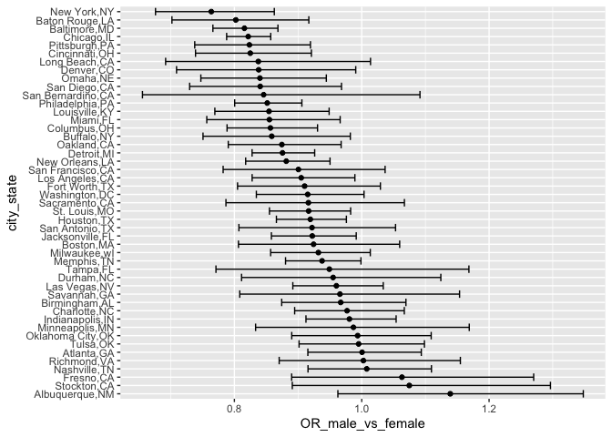

hw6_jw4007
================

``` r
library(tidyverse)
```

    ## ── Attaching packages ─────────────────────────────────────── tidyverse 1.3.2 ──
    ## ✔ ggplot2 3.3.6     ✔ purrr   0.3.4
    ## ✔ tibble  3.1.8     ✔ dplyr   1.0.9
    ## ✔ tidyr   1.2.0     ✔ stringr 1.4.1
    ## ✔ readr   2.1.2     ✔ forcats 0.5.2
    ## ── Conflicts ────────────────────────────────────────── tidyverse_conflicts() ──
    ## ✖ dplyr::filter() masks stats::filter()
    ## ✖ dplyr::lag()    masks stats::lag()

``` r
library(modelr)
library(mgcv)
```

    ## Loading required package: nlme
    ## 
    ## Attaching package: 'nlme'
    ## 
    ## The following object is masked from 'package:dplyr':
    ## 
    ##     collapse
    ## 
    ## This is mgcv 1.8-40. For overview type 'help("mgcv-package")'.

``` r
library(p8105.datasets)
set.seed(1)
```

## Q2

### Importing data

``` r
homicide_url = "https://raw.githubusercontent.com/washingtonpost/data-homicides/master/homicide-data.csv"
homicide = read.csv(homicide_url) %>% janitor::clean_names()
```

There is 52179 observations and 12 variables in the dataset. The
variables are uid, reported_date, victim_last, victim_first,
victim_race, victim_age, victim_sex, city, state, lat, lon, disposition

### Prepare data for analysis.

``` r
homicide_analyze = homicide %>% 
  mutate(case_solve = if_else(disposition == "Closed by arrest", 1, 0),
         city_state = str_c(city, state, sep = ","),
         victim_age = as.numeric(victim_age)) %>%
  filter(city_state != "Dallas,TX",
         city_state != "Phoenix,AZ", 
         city_state != "Kansas City,MO", 
         city_state != "Tulsa,AL") %>% 
  filter(victim_race == "White" | victim_race == "Black")
```

    ## Warning in mask$eval_all_mutate(quo): NAs introduced by coercion

Create a city_state variable and a binary variable indicating whether
the homicide is solved. Omit cities, limit “victim_race” is white or
black. Mutate “victim_age” as a numeric variable. There is 39693
observations and 14 variables in the dataset. The variables are uid,
reported_date, victim_last, victim_first, victim_race, victim_age,
victim_sex, city, state, lat, lon, disposition, case_solve, city_state

### Fit a logistic regression for Baltimore.

``` r
Baltimore_glm = lm(case_solve ~ victim_age + victim_sex + victim_race, data = homicide_analyze) %>% 
  broom::tidy() 
Baltimore_glm %>% 
  filter(term == "victim_sexMale") %>% 
  mutate(lower_bound = exp(estimate - 1.96*std.error),
         upper_bound = exp(estimate + 1.96*std.error),
         odds_ratio = exp(estimate)) %>% 
  select(estimate, odds_ratio, lower_bound, upper_bound) %>% knitr::kable(digits = 2)
```

| estimate | odds_ratio | lower_bound | upper_bound |
|---------:|-----------:|------------:|------------:|
|    -0.12 |       0.88 |        0.87 |         0.9 |

Outcome = resolved vs unresolved; Predictors = victim age, sex and race.
The above table shows the estimate and confidence interval of the
adjusted odds ratio for solving homicides comparing male victims to
female victims keeping all other variables fixed.

### Fit a logistic regression for all the cities in the dataset.

``` r
homicide_male_vs_female = homicide_analyze %>% 
  nest(data = !city_state) %>% 
  mutate(models = map(.x = data, ~lm(case_solve ~ victim_age + victim_sex + victim_race, data = .x)),
         results = map(models, broom::tidy)) %>% 
  select(-data, -models) %>% 
  unnest(results) %>% 
  filter(term == "victim_sexMale") %>% 
  mutate(lower_bound = exp(estimate - 1.96*std.error),
         upper_bound = exp(estimate + 1.96*std.error),
         OR_male_vs_female = exp(estimate)) %>% 
  select(city_state, estimate, OR_male_vs_female, lower_bound, upper_bound) 
knitr::kable(homicide_male_vs_female, digits = 2)
```

| city_state        | estimate | OR_male_vs_female | lower_bound | upper_bound |
|:------------------|---------:|------------------:|------------:|------------:|
| Albuquerque,NM    |     0.13 |              1.14 |        0.96 |        1.35 |
| Atlanta,GA        |     0.00 |              1.00 |        0.92 |        1.09 |
| Baltimore,MD      |    -0.20 |              0.82 |        0.77 |        0.87 |
| Baton Rouge,LA    |    -0.22 |              0.80 |        0.70 |        0.92 |
| Birmingham,AL     |    -0.03 |              0.97 |        0.87 |        1.07 |
| Boston,MA         |    -0.08 |              0.92 |        0.81 |        1.06 |
| Buffalo,NY        |    -0.15 |              0.86 |        0.75 |        0.98 |
| Charlotte,NC      |    -0.02 |              0.98 |        0.89 |        1.07 |
| Chicago,IL        |    -0.20 |              0.82 |        0.79 |        0.86 |
| Cincinnati,OH     |    -0.19 |              0.82 |        0.74 |        0.92 |
| Columbus,OH       |    -0.15 |              0.86 |        0.79 |        0.93 |
| Denver,CO         |    -0.18 |              0.84 |        0.71 |        0.99 |
| Detroit,MI        |    -0.13 |              0.88 |        0.83 |        0.93 |
| Durham,NC         |    -0.05 |              0.96 |        0.81 |        1.12 |
| Fort Worth,TX     |    -0.09 |              0.91 |        0.80 |        1.03 |
| Fresno,CA         |     0.06 |              1.06 |        0.89 |        1.27 |
| Houston,TX        |    -0.08 |              0.92 |        0.87 |        0.98 |
| Indianapolis,IN   |    -0.02 |              0.98 |        0.91 |        1.05 |
| Jacksonville,FL   |    -0.08 |              0.92 |        0.86 |        0.99 |
| Las Vegas,NV      |    -0.04 |              0.96 |        0.89 |        1.03 |
| Long Beach,CA     |    -0.18 |              0.84 |        0.69 |        1.01 |
| Los Angeles,CA    |    -0.10 |              0.90 |        0.83 |        0.99 |
| Louisville,KY     |    -0.16 |              0.85 |        0.77 |        0.95 |
| Memphis,TN        |    -0.06 |              0.94 |        0.88 |        1.00 |
| Miami,FL          |    -0.16 |              0.85 |        0.76 |        0.97 |
| Milwaukee,wI      |    -0.07 |              0.93 |        0.86 |        1.01 |
| Minneapolis,MN    |    -0.01 |              0.99 |        0.83 |        1.17 |
| Nashville,TN      |     0.01 |              1.01 |        0.92 |        1.11 |
| New Orleans,LA    |    -0.13 |              0.88 |        0.82 |        0.95 |
| New York,NY       |    -0.27 |              0.76 |        0.68 |        0.86 |
| Oakland,CA        |    -0.13 |              0.87 |        0.79 |        0.97 |
| Oklahoma City,OK  |    -0.01 |              0.99 |        0.89 |        1.11 |
| Omaha,NE          |    -0.17 |              0.84 |        0.75 |        0.94 |
| Philadelphia,PA   |    -0.16 |              0.85 |        0.80 |        0.91 |
| Pittsburgh,PA     |    -0.19 |              0.82 |        0.74 |        0.92 |
| Richmond,VA       |     0.00 |              1.00 |        0.87 |        1.15 |
| San Antonio,TX    |    -0.08 |              0.92 |        0.81 |        1.05 |
| Sacramento,CA     |    -0.09 |              0.92 |        0.79 |        1.07 |
| Savannah,GA       |    -0.03 |              0.97 |        0.81 |        1.15 |
| San Bernardino,CA |    -0.17 |              0.85 |        0.66 |        1.09 |
| San Diego,CA      |    -0.17 |              0.84 |        0.73 |        0.97 |
| San Francisco,CA  |    -0.10 |              0.90 |        0.78 |        1.04 |
| St. Louis,MO      |    -0.09 |              0.92 |        0.86 |        0.98 |
| Stockton,CA       |     0.07 |              1.07 |        0.89 |        1.30 |
| Tampa,FL          |    -0.05 |              0.95 |        0.77 |        1.17 |
| Tulsa,OK          |     0.00 |              1.00 |        0.90 |        1.10 |
| Washington,DC     |    -0.09 |              0.92 |        0.83 |        1.00 |

The above table shows the adjusted odds ratios (and CIs) for solving
homicides comparing male victims to female victims in all cities keeping
all other variables fixed.

### Plot the ORs and CIs for each city.

``` r
homicide_male_vs_female %>% 
  mutate(city_state = fct_reorder(city_state, OR_male_vs_female, .desc = TRUE)) %>% 
  ggplot(aes(x = OR_male_vs_female, y = city_state)) + 
  geom_point() +
  geom_errorbar(aes(xmin = lower_bound, xmax = upper_bound))
```

<!-- --> The above
plot shows that New York City has the lowest odds for solving homicides
when comparing male victims to female victims. The odds for solving
homicides for male victims is more than 20% lower than female victims,
keeping all other variables fixed. It is statistically significant at a
level of 5%. On the other hand, the odds for solving homicides when
comparing male victims to female victims Albuquerque is the highest,
keeping all other variables fixed. The odds for solving homicides for
male victims is 1.1 times the odds for solving homicides for female
victims, keeping all other variables fixed. However, this odds is not
statistically significant.
